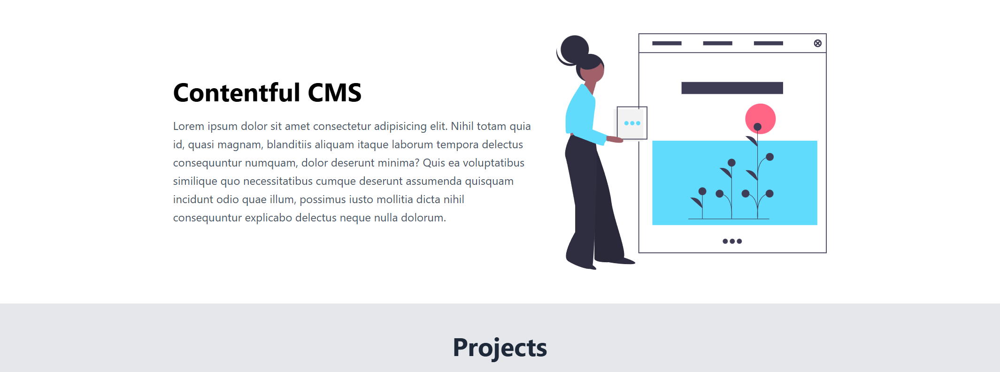
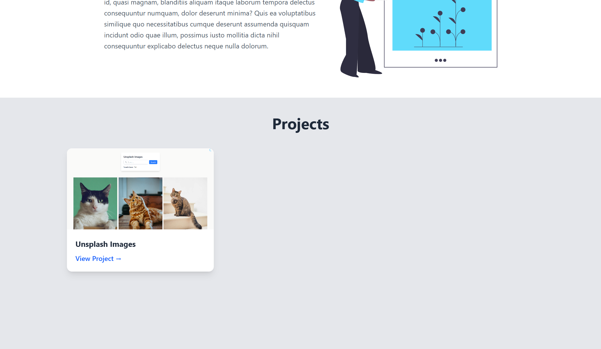

# Contentful CMS Project

This project is built using **Contentful CMS, TypeScript, and Tailwind CSS**.

## 📌 Project Purpose

The goal of this project was to store data using a **CMS (Contentful)** and retrieve it dynamically via the **Contentful CMS API**. This allows for easy content management and scalability.

## 🚀 Features

- **Content Management**: All project information is stored in Contentful CMS.
- **Data Fetching**: Retrieves and displays project data dynamically using the Contentful API.
- **Modern UI**: Styled using **Tailwind CSS** for a clean and responsive design.
- **TypeScript**: Ensures type safety and maintainability.

## 📂 How It Works

1. Created a **content model** in **Contentful CMS** to store previously developed and published project details.
2. Used the **Contentful API** to fetch project data dynamically.
3. Displayed the retrieved data on the website, allowing users to view published projects.

## 🔗 Live Demo

You can access my published projects from this website.

## 🖼️ Screenshots

### Homepage View

### Projects Section

---

### 🛠️ Technologies Used

- **Contentful CMS** - Headless CMS for content storage
- **TypeScript** - Static typing and better code maintainability
- **Tailwind CSS** - Utility-first styling for responsive design

Feel free to explore the project and let me know your thoughts! 🚀
